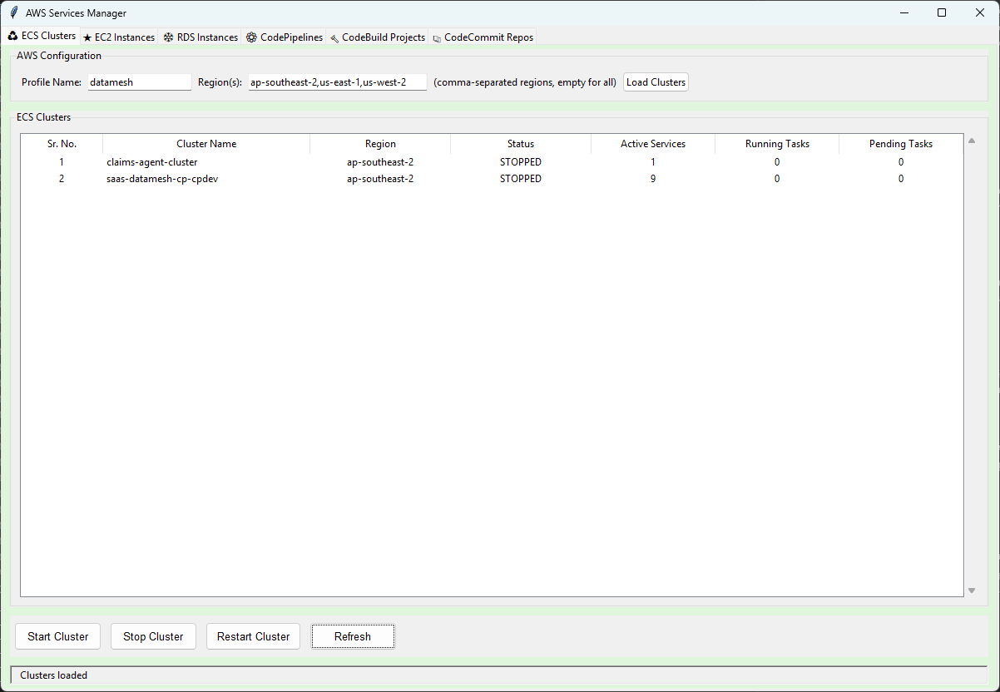

# AWS Services Manager

A comprehensive desktop application for managing multiple AWS services through an intuitive graphical user interface. This application provides a unified interface to manage ECS Clusters, EC2 Instances, RDS Instances, CodePipelines, CodeBuild Projects, and CodeCommit Repositories.

## 📋 Table of Contents

- [Overview](#overview)
- [Features](#features)
- [Prerequisites](#prerequisites)
- [Installation](#installation)
- [Configuration](#configuration)
- [Usage](#usage)
- [Application Structure](#application-structure)
- [Features by Service](#features-by-service)
- [Screenshots](#screenshots)
- [Troubleshooting](#troubleshooting)
- [Contributing](#contributing)

## 🎯 Overview

AWS Services Manager is a Python-based desktop application built with Tkinter that simplifies AWS resource management. It provides a tabbed interface where each tab is dedicated to managing a specific AWS service. The application supports multi-region operations, concurrent resource loading, and provides real-time status updates.

### Key Highlights

- **Multi-Service Management**: Manage 6 different AWS services from a single application
- **Multi-Region Support**: Query and manage resources across multiple AWS regions simultaneously
- **Tabbed Interface**: Organized interface with color-coded tabs for each service
- **Real-time Updates**: Live status updates and progress tracking
- **Bulk Operations**: Start, stop, and manage multiple resources at once
- **Search & Filter**: Quick search and filtering capabilities across all services
- **Data Export**: Copy resource information to clipboard for easy sharing

## ✨ Features

### General Features

- **Tab Management**
  - Duplicate tabs for parallel operations
  - Drag-and-drop tab reordering
  - Right-click context menu for tab operations
  - Close tabs individually

- **Multi-Region Support**
  - Configure multiple regions (comma-separated)
  - Load resources from all specified regions
  - Region-specific filtering and display

- **AWS Profile Management**
  - Support for AWS SSO profiles
  - Profile-based authentication
  - Easy profile switching

- **Search & Filter**
  - Real-time search across resource lists
  - Filter by name, status, or other attributes
  - Case-insensitive search

- **Data Export**
  - Copy resource details to clipboard
  - Export data in various formats
  - Quick copy shortcuts (Ctrl+C, Ctrl+N)

- **Progress Tracking**
  - Visual progress bars for long operations
  - Status messages and notifications
  - Real-time updates during operations

### UI Features

- **Color-Coded Tabs**: Each service has a distinct background color
- **Sortable Columns**: Click column headers to sort data
- **Status Indicators**: Color-coded status (green for running, yellow for transitioning)
- **Context Menus**: Right-click for quick actions
- **Keyboard Shortcuts**: Efficient keyboard navigation
- **Responsive Design**: Adapts to window resizing

## 📦 Prerequisites

Before installing and running the application, ensure you have the following:

1. **Python 3.7 or higher**
   - Check your Python version: `python --version` or `python3 --version`

2. **AWS CLI configured**
   - AWS CLI must be installed and configured
   - At least one AWS profile must be set up
   - For SSO profiles, ensure you're logged in: `aws sso login --profile <profile-name>`

3. **AWS Permissions**
   - Your AWS credentials must have appropriate permissions for:
     - ECS: `ecs:*`, `ec2:DescribeInstances`, `iam:GetRole`
     - EC2: `ec2:*`
     - RDS: `rds:*`
     - CodePipeline: `codepipeline:*`
     - CodeBuild: `codebuild:*`
     - CodeCommit: `codecommit:*`

4. **Operating System**
   - Windows 10/11
   - macOS
   - Linux (with GUI support)

## 🚀 Installation

### Step 1: Clone or Download the Repository

```bash
git clone <repository-url>
cd AWS_UI
```

Or download and extract the ZIP file to your desired location.

### Step 2: Create a Virtual Environment (Recommended)

```bash
# Windows
python -m venv venv
venv\Scripts\activate

# macOS/Linux
python3 -m venv venv
source venv/bin/activate
```

### Step 3: Install Dependencies

```bash
pip install -r requirements.txt
```

### Step 4: Verify Installation

```bash
python aws_manager_ui.py
```

The application window should open successfully.

## ⚙️ Configuration

### AWS Profile Setup

1. **Configure AWS CLI** (if not already done):
   ```bash
   aws configure --profile <profile-name>
   ```

2. **For AWS SSO Profiles**:
   ```bash
   aws configure sso --profile <profile-name>
   aws sso login --profile <profile-name>
   ```

3. **AWS Profile**: Enter your AWS profile name in the application's configuration fields. The profile must be configured in your AWS CLI.

### Region Configuration

- Enter regions as comma-separated values: `us-east-1,us-west-2,ap-southeast-2`
- Leave empty to query all available regions (may take longer)
- Default regions vary by service

## 📖 Usage

### Starting the Application

```bash
python aws_manager_ui.py
```

### Basic Workflow

1. **Select AWS Profile**: Enter your AWS profile name in the "Profile Name" field
2. **Enter Regions**: Specify regions (comma-separated) or leave empty for all
3. **Load Resources**: Click "Load" button for the respective service
4. **Manage Resources**: Use buttons or context menus to perform actions
5. **Search/Filter**: Use the search box to filter resources
6. **Export Data**: Right-click and select copy options or use keyboard shortcuts

### Keyboard Shortcuts

- **Ctrl+C**: Copy selected row data
- **Ctrl+N**: Copy resource names
- **Enter**: Trigger load operation (when focus is on input fields)
- **Right-Click**: Open context menu

## 🏗️ Application Structure

```
AWS_UI/
│
├── aws_manager_ui.py      # Main application entry point
├── ecs_ui.py              # ECS Cluster management module
├── ec2_ui.py              # EC2 Instance management module
├── rds_ui.py              # RDS Instance management module
├── pipeline_ui.py         # CodePipeline management module
├── codebuild_ui.py        # CodeBuild Project management module
├── codecommit_ui.py       # CodeCommit Repository management module
├── requirements.txt       # Python dependencies
└── README.md             # This file
```

## 🔧 Features by Service

### ♻ ECS Clusters

**Main Features:**
- Load ECS clusters from multiple regions
- View cluster status, active services, running/pending tasks
- Start, stop, and restart entire clusters
- View and manage services within clusters
- View container images used in services
- View and update CPU/Memory configuration
- Copy cluster names and details

**Actions:**
- **Load Clusters**: Fetch all clusters from specified regions
- **Start Cluster**: Start all services in a cluster
- **Stop Cluster**: Stop all services in a cluster
- **Restart Cluster**: Restart all services in a cluster
- **Refresh**: Reload cluster data
- **Show Services**: Open detailed services view
- **Show Images**: View container images
- **Show CPU Memory Config**: View and edit service configurations



*ECS Clusters tab showing cluster list with status indicators*

**Screenshot Placeholder:**
```
[Insert screenshot: ECS Services window showing services with checkboxes for bulk operations]
```

**Screenshot Placeholder:**
```
[Insert screenshot: ECS Container Images window showing image details]
```

**Screenshot Placeholder:**
```
[Insert screenshot: ECS CPU/Memory Configuration window]
```

### ★ EC2 Instances

**Main Features:**
- Load EC2 instances from multiple regions
- View instance name, ID, state, type, and region
- Start and stop instances
- Color-coded status indicators
- Copy instance details

**Actions:**
- **Load Instances**: Fetch all instances from specified regions
- **Start Instance**: Start selected stopped instances
- **Stop Instance**: Stop selected running instances
- **Refresh**: Reload instance data

**Screenshot Placeholder:**
```
[Insert screenshot: EC2 Instances tab showing instance list with running/stopped status]
```

**Screenshot Placeholder:**
```
[Insert screenshot: EC2 instance start/stop operation in progress]
```

### ❄ RDS Instances

**Main Features:**
- Load RDS instances from multiple regions
- View instance ID, status, size, engine, and region
- Start and stop RDS instances
- Color-coded status indicators
- Copy instance details

**Actions:**
- **Load Instances**: Fetch all RDS instances from specified regions
- **Start Instance**: Start selected stopped instances
- **Stop Instance**: Stop selected running instances
- **Refresh**: Reload instance data

**Screenshot Placeholder:**
```
[Insert screenshot: RDS Instances tab showing database instances with status]
```

**Screenshot Placeholder:**
```
[Insert screenshot: RDS instance start/stop confirmation dialog]
```

### ⚙ CodePipelines

**Main Features:**
- Load CodePipelines from multiple regions
- View pipeline status, last updated time, region
- View pipeline JSON configuration
- Update pipeline environment variables
- Duplicate pipelines
- Copy pipeline and repository links
- Open pipelines in AWS Console

**Actions:**
- **Load Pipelines**: Fetch all pipelines from specified regions
- **View JSON**: Display pipeline configuration
- **Update Pipeline**: Modify environment variables
- **Duplicate Pipeline**: Create a copy of a pipeline
- **Copy Link**: Copy pipeline or repository URL
- **Open in Console**: Launch AWS Console for the pipeline

**Screenshot Placeholder:**
```
[Insert screenshot: CodePipelines tab showing pipeline list with status]
```

**Screenshot Placeholder:**
```
[Insert screenshot: Pipeline JSON viewer window]
```

**Screenshot Placeholder:**
```
[Insert screenshot: Update Pipeline Environment Variables dialog]
```

**Screenshot Placeholder:**
```
[Insert screenshot: Duplicate Pipeline dialog]
```

### 🔨 CodeBuild Projects

**Main Features:**
- Load CodeBuild projects from multiple regions
- View project name, status, last modified, region
- View project JSON configuration
- Update project environment variables
- Copy project links
- Open projects in AWS Console
- Backup functionality before modifications

**Actions:**
- **Load Projects**: Fetch all projects from specified regions
- **View JSON**: Display project configuration
- **Update Project**: Modify environment variables
- **Copy Link**: Copy project URL
- **Open in Console**: Launch AWS Console for the project

**Screenshot Placeholder:**
```
[Insert screenshot: CodeBuild Projects tab showing project list]
```

**Screenshot Placeholder:**
```
[Insert screenshot: CodeBuild Project JSON viewer]
```

**Screenshot Placeholder:**
```
[Insert screenshot: Update CodeBuild Project Environment Variables dialog]
```

### 📚 CodeCommit Repositories

**Main Features:**
- Load CodeCommit repositories from multiple regions
- View repository name, description, last modified, created date
- Copy repository links (HTTP and SSH)
- Open repositories in AWS Console
- Search and filter repositories

**Actions:**
- **Load Repositories**: Fetch all repositories from specified regions
- **Copy HTTP URL**: Copy HTTPS clone URL
- **Copy SSH URL**: Copy SSH clone URL
- **Open in Console**: Launch AWS Console for the repository

**Screenshot Placeholder:**
```
[Insert screenshot: CodeCommit Repositories tab showing repository list]
```

**Screenshot Placeholder:**
```
[Insert screenshot: CodeCommit repository context menu with copy options]
```

## 📸 Screenshots

### Main Application Window

**Screenshot Placeholder:**
```
[Insert screenshot: Main application window showing all tabs with color-coded backgrounds]
```

### Tab Management

**Screenshot Placeholder:**
```
[Insert screenshot: Right-click context menu on tabs showing duplicate and close options]
```

**Screenshot Placeholder:**
```
[Insert screenshot: Multiple duplicated tabs for the same service]
```

### Search and Filter

**Screenshot Placeholder:**
```
[Insert screenshot: Search functionality filtering resources in real-time]
```

### Progress Indicators

**Screenshot Placeholder:**
```
[Insert screenshot: Progress bar showing resource loading progress]
```

### Status Messages

**Screenshot Placeholder:**
```
[Insert screenshot: Status message popup showing operation completion]
```

## 🔍 Troubleshooting

### Common Issues

#### 1. **Profile Not Found Error**

**Problem**: `ProfileNotFound` error when loading resources

**Solution**:
- Verify your AWS profile name is correct
- Ensure AWS CLI is configured: `aws configure list --profile <profile-name>`
- For SSO profiles, login first: `aws sso login --profile <profile-name>`

#### 2. **Permission Denied Errors**

**Problem**: `AccessDenied` or `UnauthorizedOperation` errors

**Solution**:
- Check your AWS IAM permissions
- Ensure your profile has necessary permissions for the service
- Contact your AWS administrator to grant required permissions

#### 3. **Application Not Starting**

**Problem**: Application window doesn't open or crashes immediately

**Solution**:
- Verify Python version: `python --version` (should be 3.7+)
- Check if all dependencies are installed: `pip list`
- Reinstall dependencies: `pip install -r requirements.txt --force-reinstall`
- Check for error messages in terminal/command prompt

#### 4. **Slow Loading Times**

**Problem**: Resources take too long to load

**Solution**:
- Reduce the number of regions being queried
- Check your network connection
- Verify AWS service availability in your regions
- Some operations are inherently slow (e.g., loading many resources)

#### 5. **Tkinter Import Error**

**Problem**: `ModuleNotFoundError: No module named 'tkinter'`

**Solution**:
- **Linux**: Install tkinter: `sudo apt-get install python3-tk` (Ubuntu/Debian) or `sudo yum install python3-tkinter` (CentOS/RHEL)
- **macOS**: Usually pre-installed with Python
- **Windows**: Usually pre-installed with Python

#### 6. **Boto3 Session Errors**

**Problem**: `NoCredentialsError` or session-related errors

**Solution**:
- Verify AWS credentials: `aws sts get-caller-identity --profile <profile-name>`
- Re-authenticate SSO profiles: `aws sso login --profile <profile-name>`
- Check credential expiration for temporary credentials

### Getting Help

If you encounter issues not covered here:

1. Check the terminal/command prompt for error messages
2. Verify AWS CLI is working: `aws --version`
3. Test AWS connectivity: `aws sts get-caller-identity`
4. Review AWS CloudTrail logs for permission issues
5. Check application logs (if available)

## 🤝 Contributing

Contributions are welcome! If you'd like to contribute:

1. Fork the repository
2. Create a feature branch: `git checkout -b feature/new-feature`
3. Make your changes
4. Test thoroughly
5. Submit a pull request

### Development Setup

1. Clone the repository
2. Create a virtual environment
3. Install dependencies: `pip install -r requirements.txt`
4. Make your changes
5. Test with different AWS profiles and regions

## 📝 License

[Specify your license here]

## 👥 Authors

[Add author information]

## 🙏 Acknowledgments

- Built with Python and Tkinter
- Uses boto3 for AWS API interactions
- Thanks to the AWS community for support and feedback

---

**Note**: This application requires valid AWS credentials and appropriate IAM permissions to function. Always follow AWS security best practices when managing credentials.

